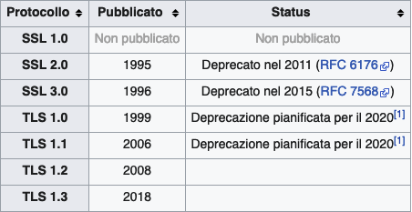

# Cosa sono

TLS = Transport Layer Security

SSL = Secure Sockets Layer

> Sono dei protocolli crittografici di presentazione usati nel campo delle telecomunicazione e dell'informatica che permettono una comunicazione sicura dalla sorgente al destinatario (end-to-end) su reti TCP/IP fornendo autenticazione, integrità dei dati e confidenzialità.
> 

Fonte: [wikipedia](https://it.wikipedia.org/wiki/Transport_Layer_Security)

Le applicazioni client-server usano il protocollo TLS per comunicare attraverso la rete.

Considerando che le applicazioni possono comunicare sia con sia senza TLS/SSL allora è necessario che sia il client a indicare al server quale tipo di connessione vule intraprendere. Uno dei modi per farlo è usando una porta differente: 80 per usare il traffico HTTP non criptato mentre la 443 per il traffico criptato HTTPS.

Una volta che il client e il server si sono messi d'accordo per usare il TLS, cominciano a negoziare una connessione stateful usando la procedura dell'handshaking. Il portocollo usa l'handshake con asymmetric cipher per stabilire non solo quali sono le configurazioni chiper, ma anche qual è la chiave da condividere per quella specifica sessione con la quale le comunicazioni future verranno criptate usando symmetric cipher.

Durante questo handshake il client e il server si accordano in molti parametri per rendere la connessione sicura:

- Inizia con il client che si connette al server TLS-enabled richiedeno una connessione sicura presentando una lista di cipher suites supportati (non sono altro che funzioni HASH)
- Da questa lista il server prende una delle funzioni che supporta notificando della scelta anche il client
- Il server solitamente invia anche la sua identificazione nlla forma di un certificato digitale (CSR) che contiene il nome del server, la [CA](https://www.notion.so/CA-6bde753a9e374f4286d82a97483e4251) che ha certificato il [CSR](https://www.notion.so/CSR-edfe01b002314be1af171767c0e8d9e9) e la chiave pubblica.
- Prima di procedere il client verificherà la validità del certificato.
- Per generare la chiave di sessione per la connessione sicura, il client deve:
    - criptare il PreMasterSecret (random number) con la chiave pubblica del server e inviare il risultato al server con il quale entrambi andranno a generare una chiave di sessione unica.
    - usare la chiave di scambio Diffie-Hellman per generare in modo sicuro una chiave di sesssione casuale  e unica per criptare e decriptare che ha una proprietà addizionale per la segretezza futura: se la chiave privata viene divulgata in futuro non può essere decriptata la sessione corrente, anche se la sessione è intercettata e registrata da terze parti.

Ovviamente se uno dei passi descritti sopra fallisce la connessione non viene stabilita.

Quando la connessione è protetta dal TLS allora una delle seguenti proprietà deve essere confermata:

- la connessione è privata o sicura grazie al symmetric-key algorithm usato per criptare i dati trasmessi.
- L'identità delle parti comunicanti può essere autenticata usando una public-key crittografata.
- La connessione è affidabile perchè ogni mesaggio trasmesso incude un check sull'integrità del messaggio usando un codice di autenticazione del messaggio impedendo una perdita o alterazione dei dati durante la trasmissione.
